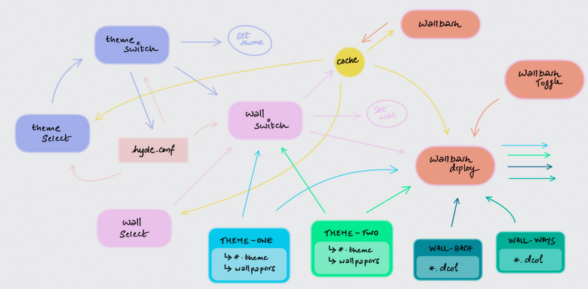

## Big Picture

https://github.com/prasanthrangan/hyprdots/issues/1282 <-- This was where it all began

- ~/.local/share/bin has soo many important stuff

- This is how it ALL WORKS
1. ~/.local/share/bin/themeselect.sh <--- done first, calls the second
2. ~/.local/share/bin/themeswitch.sh <--- this is how theme w

How are kitty themes copied 
MapleNerd.tar.gz in Source/arcs [try]

