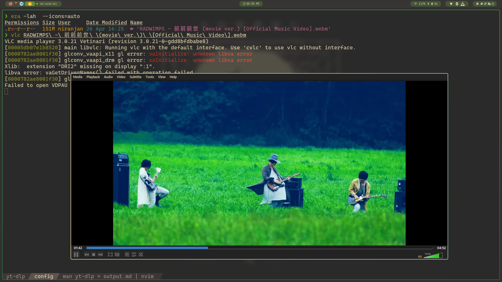

# Installing yt-dlp

You can have MULTIPLE config files ; 
- one for downloading every vid+aud in a playlist
- one for downloading jap songs with subtitles

test :- https://www.youtube.com/watch?v=PDSkFeMVNFs&pp=ygULemVuemVuemVuc2U%3D [ZENZENSE]

```sh
yt-dlp -f bestaudio --extract-audio --audio-format mp3 --audio-quality 0 URL

```




# Installing `youtube-dl` [DEPRECATED_NOW; use yt-dlp]

https://github.com/ytdl-org/youtube-dl <-- Readme has CONCISE stuff

```sh
sudo curl -L https://yt-dl.org/downloads/latest/youtube-dl -o /usr/local/bin/youtube-dl
sudo chmod a+rx /usr/local/bin/youtube-dl
```

If you get something like this :-
```xml
<h1>Access denied</h1>

<p>
  Due to a <a href="https://openjur.de/u/2466945.html" target="_blank">ruling</a> of the Hamburg Regional Court, access to this website is blocked.
</p>

<hr />

<h1>Zugriff gesperrt</h1>

<p>
  Aufgrund eines <a href="https://openjur.de/u/2466945.html" target="_blank">Urteils</a> des Landgerichts Hamburg ist der Zugriff auf diese Website gesperrt.
</p>

```

FRICKIN TURN OFF THE VPN !!

Also just use `yt-dlp` <------ WAYYYYYYY better

# Installing Postgres

CONCISE and commands

https://gist.github.com/NickMcSweeney/3444ce99209ee9bd9393ae6ab48599d8


# Installing VPN 

```sh
# these are already shiped with HyDE
sudo pacman -S openvpn networkmanager networkmanager-openvpn network-manager-applet 
sudo systemctl enable NetworkManager.service
```


# Installing Tor


```sh

sudo systemctl start tor
sudo systemctl status tor

sudo nvim /etc/tor/torrc
```

UNCOMMENT THESE LINES

Control Port 
CookieAuthentication 1

ADD THESE LINES
CookieAuthFile /var/lib/tor/control_auth_cookie
CookieAuthFileGroupReadable  1
DataDirectoryGroupReadable   1


```sh
sudo usermod -a -G tor niranjan
newgrp tor

sudo systemctl restart tor

# what are the permissions for these folders
stat -c%a /var/lib/tor /var/lib/tor/control_auth_cookie

750
640

# turn HISTORY OFF, cuz you are about to set a password 
set +o history
tor --hash-password Acta,,N0nVerba
# COPY THE HASH
16:B9C4FA982134591060BEA6597046A9255911D920CEE6370A1CADFEF587

set -o history
# turns history on

sudo systemctl stop tor

# set up the control_socket WITH THE NEW HASH

sudo nvim /etc/tor/torrc
```

HashedControlPassword <whatever was the output you copied >
ControlSocket /var/lib/tor/control_socket
ControlSocketsGroupWritable 1
CacheDirectoryGroupReadable 1


```sh

sudo systemctl start tor
stat -c%a /var/lib/tor/control_socket
660


# Check if the port is listening
echo -e 'PROTOCOLINFO\r\n' | nc localhost 9051
# or
echo -e 'PROTOCOLINFO\r\n' | nc 127.0.0.1 9051
```
250-PROTOCOLINFO 1
250-AUTH METHODS=COOKIE,SAFECOOKIE,HASHEDPASSWORD COOKIEFILE="/var/lib/tor/control_auth_cookie"
250-VERSION Tor="0.4.8.12"
250 OK
514 Authentication required.

Means it's listening !

```sh
echo -e 'PROTOCOLINFO\r\n' | sudo -u niranjan socat - UNIX-CLIENT:/var/lib/tor/control_socket
```

250-PROTOCOLINFO 1
250-AUTH METHODS=COOKIE,SAFECOOKIE,HASHEDPASSWORD COOKIEFILE="/var/lib/tor/control_auth_cookie"
250-VERSION Tor="0.4.8.12"
250 OK
514 Authentication required.


Now in Firefox settings, go to the bottom => Network Setting => Manual Proxy Configuration
SOCKS HOST : localhost # this is cuz we have the tor service running 
SOCKS PORT : 9050
SOCKS v5
Check the "Proxy  DNS when using SOCKSv5"

Now you can use this to check if you're Browser is using Tor
https://check.torproject.org/ 


```


# Installing QEMU + VirtManager
```sh
sudo pacman -S qemu virt-manager virt-viewer dnsmasq vde2 bridge-utils openbsd-netcat ebtables iptables libguestfs

# add your user and create group:
sudo usermod -a -G libvirt $(whoami)
newgrp libvirt

sudo nvim /etc/libvirt/libvirtd.conf

```

`nvim /etc/libvirt/libvirtd.conf`
uncomment the lines :- 

unix_sock_group = "libvirt"
unix_sock_rw_perms = "0770"


```sh
sudo systemctl enable --now libvirtd
sudo systemctl start libvirtd1
```
S

# Installing Docker, setting up a NextJS project

```sh
sudo pacman -S gnome-terminal
sudo pacman -S docker

# when you do enable, it'll automatically do start too ; it's kinda redundant but oh well !
sudo systemctl enable --now docker
sudo systemctl start  --now docker
# this will be the output 
# Created symlink '/etc/systemd/system/multi-user.target.wants/docker.service' → '/usr/lib/systemd/system/docker.service'


sudo docker info                    # is docker running properly

sudo usermod -a -G docker niranjan  # to make docker be ran by a user otehr than root

sudo docker info                    # is docker running properly

su niranjan # log back into your account 


docker run -d -p 80:80 docker/getting-started  # now you have a guide that can be ran from localhost:80


# from AUR install docker desktop

sudo systemctl status docker 

```

#### Trouble shoot :-

If there is any can't find in mirror list error, just do the below

you can add more nameservers to /etc/resolv.conf
```
nameserver 8.8.8.8
nameserver 8.8.4.4
```

```sh
sudo systemctl daemon-reload
sudo systemctl restart docker
```


#### Dokcer compose installation

https://docs.docker.com/compose/install/linux/#install-the-plugin-manually 

```sh
DOCKER_CONFIG=${DOCKER_CONFIG:-$HOME/.docker}
mkdir -p $DOCKER_CONFIG/cli-plugins
curl -SL https://github.com/docker/compose/releases/download/v2.28.1/docker-compose-linux-x86_64 -o $DOCKER_CONFIG/cli-plugins/docker-compose


chmod +x $DOCKER_CONFIG/cli-plugins/docker-compose

docker compose version
```